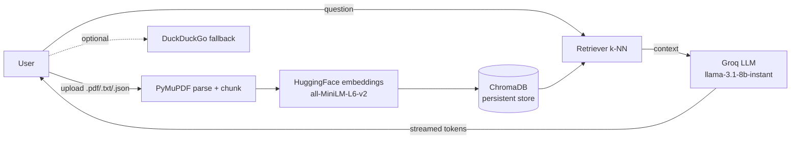

# PDF RAG Chatbot

### Upload a document, ask questions, get streamed and source-grounded answers.

A polished, **user-facing** Retrieval-Augmented Generation (RAG) application that
demonstrates the complete end-user experience of RAG: drop in a `.pdf`, `.txt`, or
`.json` file, ask questions in natural language, and watch grounded answers stream
back token-by-token — with a web-search fallback and conversational memory.

This repo is the **product layer**. Its sibling, [RAG_Pipeline](https://github.com/satyamshivam13/RAG_Pipeline),
is the **engineering/backend platform** (FAISS, guardrails, RAGAS evaluation,
OpenTelemetry, Docker). Together they show both halves of a real RAG system —
*how the engine is built* and *what the product feels like*. See the
[comparison](#how-this-complements-rag_pipeline).

[](https://pdfragchatbot-01.streamlit.app/)


> 🚀 **[Live demo](https://pdfragchatbot-01.streamlit.app/)** — running on Streamlit Community Cloud. See [DEPLOYMENT.md](DEPLOYMENT.md) for how it's deployed.

---

## Features

- **Document Q&A** — upload `.pdf`, `.txt`, or `.json` and ask questions grounded in the content
- **Streaming answers** — responses render token-by-token in both the Streamlit UI and the API
- **Conversational memory** — the FastAPI backend keeps chat context across turns
- **Web-search fallback** — optional DuckDuckGo search when documents don't cover the question
- **Persistent vectors** — ChromaDB store with MD5 hashing to skip re-embedding duplicate files
- **Cloud-native LLM** — Groq Cloud API; **no Ollama, no local GPU, no model downloads**
- **Graceful configuration** — missing `GROQ_API_KEY` shows a friendly message, never a stack trace

---

## How this complements RAG_Pipeline

|  | **PDF_RAG_Chatbot** (this repo) | **[RAG_Pipeline](https://github.com/satyamshivam13/RAG_Pipeline)** |
|---|---|---|
| **Purpose** | End-user product — "what RAG feels like" | Production engine — "how RAG is built & measured" |
| **Audience** | Recruiters, PMs, end users | Backend / ML engineers |
| **Interface** | Streamlit UI + FastAPI + chat HTML | API + Python SDK (no UI) |
| **Architecture** | Upload → Chroma → Groq → stream | Chunk → FAISS+MMR → guardrail → generate → RAGAS eval |
| **Strengths** | Interactive UX, file upload, streaming, web fallback | Quality gates, observability, Docker, measured metrics |
| **Deployment** | Streamlit Community Cloud (1-click) | Docker / docker-compose |

The two repos share **no code** and use different vector stores; the overlap is
thematic, not functional. This one shows the **experience**, the other shows the
**engineering rigor**.

---

## Architecture



```text
[Upload] -> [Parse+Chunk] -> [Embed] -> [ChromaDB]
[Question] -> [Retrieve top-k] -> [Groq LLM + context] -> [Stream answer]
                                          \-> [DuckDuckGo fallback]
```

| Layer | Technology |
|---|---|
| UI | Streamlit |
| API | FastAPI + Uvicorn (streaming, upload, `/health`, web search) |
| LLM | Groq Cloud — `llama-3.1-8b-instant` (OpenAI-compatible) |
| Embeddings | sentence-transformers `all-MiniLM-L6-v2` (local CPU) |
| Vector store | ChromaDB (persistent, MD5 de-duplication) |
| Orchestration | LangChain (0.1.x) |
| Doc parsing | PyMuPDF (`fitz`) |
| Web fallback | DuckDuckGo Search |

---

## Local Setup

### 1. Clone the repo

```bash
git clone https://github.com/satyamshivam13/PDF_RAG_Chatbot.git
cd PDF_RAG_Chatbot
```

### 2. Create a virtual environment

```bash
python -m venv venv
venv\Scripts\activate        # Windows
# source venv/bin/activate   # macOS / Linux
```

### 3. Install dependencies

```bash
pip install -r requirements.txt
```

### 4. Configure your Groq API key

Get a free key at [console.groq.com/keys](https://console.groq.com/keys), then set it
(see [LLM Provider](#llm-provider) for per-OS details). A missing key won't crash the
app — you'll get a clear message telling you what to set.

### 5. (Optional) Pre-load the sample document

```bash
python vectorstore.py
```

### 6. Run the Streamlit UI (primary)

```bash
streamlit run streamlit_app.py
```

### 7. (Optional) Run the FastAPI backend + HTML chat

```bash
uvicorn rag_api:app --reload --port 8000   # then open index.html
```

---

## LLM Provider

This project uses the **Groq Cloud API** for LLM inference — there is **no Ollama,
no local GPU, and no model download** required.

- **Provider:** Groq Cloud (OpenAI-compatible chat completions)
- **Default model:** `llama-3.1-8b-instant`
- **Embeddings:** local CPU via `sentence-transformers/all-MiniLM-L6-v2` (~90 MB)
- **Why Groq:** very low latency (great for streaming) and a generous free tier, so the
  app stays fully cloud-deployable with no local model hosting.

### Environment variables

| Variable | Required | Default | Description |
|---|---|---|---|
| `GROQ_API_KEY` | ✅ Yes | — | Groq API key from [console.groq.com/keys](https://console.groq.com/keys) |
| `LLM_MODEL` | No | `llama-3.1-8b-instant` | Override the Groq chat model |
| `LLM_BASE_URL` | No | Groq default | Point at any OpenAI-compatible endpoint |
| `CHUNK_SIZE` | No | `1000` | Characters per embedded chunk |
| `CHUNK_OVERLAP` | No | `150` | Character overlap between chunks |
| `TOP_K` | No | `4` | Number of chunks retrieved per question |

**Windows (PowerShell):**
```powershell
$env:GROQ_API_KEY = "your_api_key_here"
```

**macOS / Linux (bash/zsh):**
```bash
export GROQ_API_KEY="your_api_key_here"
```

Or create a git-ignored `.env` file in the project root:
```env
GROQ_API_KEY=your_api_key_here
```

---

## Deployment (Streamlit Community Cloud)

This app is built to deploy with no local model hosting. Full instructions and a
post-deploy validation checklist are in **[DEPLOYMENT.md](DEPLOYMENT.md)**.

Quick version: push to GitHub → [share.streamlit.io](https://share.streamlit.io) →
deploy `streamlit_app.py` → paste `GROQ_API_KEY` into **Secrets** (see
[`.streamlit/secrets.toml.example`](.streamlit/secrets.toml.example)).

---

## Screenshots

_No screenshots yet._ Drop `screenshot.png` and/or `demo.gif` into [`docs/`](docs/)
(see [docs/README.md](docs/README.md) for guidance), then uncomment the lines below:

<!-- After adding the files, uncomment:


-->

> Tip: a 15–30s GIF of upload → question → streamed answer is the single most
> effective recruiter asset for this repo.

---

## Known Limitations

- **Ephemeral storage on Cloud** — the ChromaDB `db/` store doesn't persist across
  Streamlit Cloud restarts; uploads live for the container's lifetime.
- **Free-tier sleep & token caps** — the Cloud app sleeps when idle (cold start on
  wake), and Groq's free tier has a daily token cap.
- **Chunking is a trade-off** — defaults are 1000/150 with `TOP_K=4`; very large PDFs
  may want bigger chunks or higher `k` (all tunable via env vars).
- **API chat memory is process-global** — fine for a single-user demo, not multi-tenant.
- **Streamlit UI vs. API** — only the Streamlit app is deployed by the Cloud flow; the
  FastAPI backend and `index.html` are for local/self-hosted use.

---

## Future Roadmap

- [ ] Verified live Streamlit Cloud deployment + live-demo badge
- [ ] Inline source/citation display under each answer
- [ ] Per-session memory and a visible "New conversation" control in the UI
- [ ] Configurable chunk size / top-k from the UI
- [ ] Smoke tests + CI (see Phase 8) → broader integration tests
- [ ] Optional swap to a larger Groq model via `LLM_MODEL`

---

## License

MIT — see [LICENSE](./LICENSE).

## Acknowledgments

- [LangChain](https://github.com/langchain-ai/langchain)
- [Groq](https://groq.com/)
- [ChromaDB](https://www.trychroma.com/)
- [Streamlit](https://streamlit.io/)
- [FastAPI](https://fastapi.tiangolo.com/)
